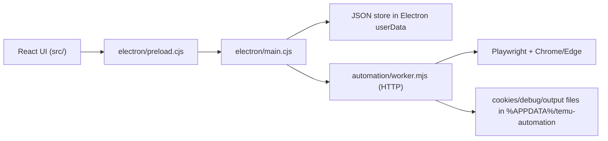

# Runtime And Architecture

## Overview

This project currently runs as an Electron desktop app with a React renderer and a Playwright-based automation worker.

The active path is:

1. `src/` renders the UI with Vite + React + Ant Design.
2. `electron/preload.cjs` exposes `window.electronAPI` to the renderer.
3. `electron/main.cjs` receives renderer IPC calls, manages the desktop window, and proxies automation requests.
4. `automation/worker.mjs` runs the browser automation and scraping logic over a local HTTP interface.

`src-tauri/` is legacy migration work and is not the active runtime.

## Requirements

- Windows environment
- Node.js installed and available on `PATH`
- Root dependencies installed with `npm install`
- Google Chrome or Microsoft Edge installed locally
- A Temu seller account that can log in through the seller portal

Notes:

- The worker looks for a system browser in standard Chrome and Edge install paths.
- The worker is started by Electron automatically. `automation/start-worker.cmd` is only a manual helper and not the normal boot path.
- Some product creation flows may use external AI configuration loaded from local `.env` files referenced inside `automation/worker.mjs`.

## Common commands

- `npm run dev`
  Starts the recommended local development flow. This runs Vite and then opens Electron after the dev server is ready.

- `npm run dev:web`
  Starts only the frontend dev server on port `1420`.

- `npm run electron`
  Opens Electron in development mode and expects the Vite dev server to already be running.

- `npm run build`
  Builds the renderer bundle into `dist/`.

- `npm run tauri:legacy`
  Legacy command kept only for reference while `src-tauri/` remains in the repository.

## Boot sequence

### Development mode

1. `npm run dev` starts Vite.
2. Electron waits for `http://localhost:1420`.
3. Electron creates the main window and loads the Vite renderer.
4. Electron auto-starts `automation/worker.mjs`.
5. Electron waits for the worker HTTP service to answer `ping`.
6. The renderer calls `window.electronAPI`, and Electron forwards those requests to the worker or to local file storage handlers.

### Production-style renderer build

1. `npm run build` compiles TypeScript and builds the Vite bundle.
2. Electron can load `dist/index.html` when a built renderer is available.

## Architecture map

### Renderer

- `src/App.tsx`
  Router entry for the active React application.

- `src/pages/`
  Main business views such as accounts, collection dashboard, products, tasks, and settings.

- `src/contexts/CollectionContext.tsx`
  Orchestrates collection flows from the UI. It triggers automation commands, reads raw scrape outputs, parses key datasets, and persists processed results through `window.electronAPI.store`.

### Electron shell

- `electron/main.cjs`
  Owns app lifecycle, window creation, worker lifecycle, HTTP proxying to the worker, and JSON file persistence for `store:get` and `store:set`.

- `electron/preload.cjs`
  Defines the renderer-safe API surface exposed as `window.electronAPI`.

### Automation runtime

- `automation/worker.mjs`
  Active automation entrypoint. It hosts an HTTP server, tracks long-running task progress, drives Playwright, and implements the real scraping, login, product creation, and auto-pricing behavior.

- `automation/browser.mjs`
  Browser lifecycle, cookie persistence, and login helpers used by the worker.

- `automation/scrape-registry.mjs`
  Registry of scrape handlers used by the worker for many collection actions.

- `automation/src/`
  Older TypeScript sidecar experiment. It is not part of the current Electron runtime path.

### Legacy Tauri workspace

- `src-tauri/`
  Legacy Rust/Tauri shell and command experiments kept for reference only.

## Request flow

## Data and storage

### Renderer-side persisted data

Electron implements a lightweight JSON file store instead of using a database for the active UI path.

- The renderer calls `window.electronAPI.store.get(key)` and `window.electronAPI.store.set(key, data)`.
- Electron persists each key as a JSON file under the app `userData` directory.
- In practice this is typically under `%APPDATA%/temu-automation/`, though Electron ultimately decides the exact `userData` path.

Examples stored by the current UI include:

- `temu_accounts`
- `temu_app_settings`
- `temu_dashboard`
- `temu_products`
- `temu_orders`
- `temu_sales`
- `temu_flux`
- `temu_task_manager_state`
- many `temu_raw_*` collection outputs

### Worker-side files

The worker and browser helpers also write directly under `%APPDATA%/temu-automation/`.

Common directories and files:

- `cookies/`
  Per-account cookie snapshots

- `debug/`
  Screenshots, failed payloads, batch results, and other debug artifacts

- `worker-port`
  Port file used so Electron can detect and stop an old worker

### Runtime settings behavior

The Electron settings page persists `temu_app_settings`, and the automation runtime reads that file directly.

Currently active runtime settings:

- `headless`
  Applied the next time the browser is launched

- `operationDelay`
  Scales shared automation delays and Playwright `slowMo`

- `maxRetries`
  Used by current login retry and batch product creation retry flows

- `autoLoginRetry`
  Enables one automatic retry when login fails

- `screenshotOnError`
  Captures a screenshot from the latest open automation page when a worker request fails

- `lowStockThreshold`
  Used by the product list view and task manager to mark low-stock items

Settings that are already stored but not fully consumed by the worker yet:

- `lowStockThreshold`
  Currently active in the renderer product warning view and the manual task-manager stock check, but not yet consumed by the worker for background alerting

## Current operational flow

### Login

1. Add an account in the Accounts page.
2. The account list is stored as JSON through `window.electronAPI.store`.
3. Clicking login calls `window.electronAPI.automation.login`.
4. Electron forwards the request to the worker.
5. The worker starts or reuses a browser, logs into the Temu seller portal, and saves cookies for reuse.

### Collection

1. The collection dashboard triggers `scrapeAll` or a narrower scrape command.
2. Electron forwards that request to the worker.
3. The worker performs scraping and persists raw outputs.
4. `CollectionContext` reads selected raw outputs back through `readScrapeData`.
5. The renderer parses core datasets and stores processed JSON snapshots for the rest of the UI.

### Task manager

1. The Tasks page reads `temu_task_manager_state`, `temu_app_settings`, `temu_products`, and `temu_sales`.
2. The inventory alert task computes low-stock items inside the renderer from the latest processed store snapshots.
3. Running the check manually updates the latest result and timestamp back into `temu_task_manager_state`.
4. This is currently a renderer-side operational aid, not a background scheduler owned by the worker.

## Known limitations

- `src/pages/Settings.tsx` now persists settings locally, but the automation worker still only consumes a subset of those values at runtime.
- `src/pages/TaskManager.tsx` now persists inventory-alert state and can run a manual stock check, but it is still not a full background scheduler.
- `automation/src/` and `src-tauri/` can still confuse new contributors because they look active but are not connected to the current production path.
- The worker is a very large monolithic file, so automation changes should be tested carefully even when the renderer change seems small.
- The renderer bundle is currently large enough for Vite to warn during production build.

## Where to change what

- UI layout, routing, pages, and charts:
  edit `src/`

- preload-safe bridge APIs:
  edit `electron/preload.cjs`

- desktop lifecycle, worker startup, file store, IPC handlers:
  edit `electron/main.cjs`

- browser automation, login, scraping, product creation, pricing:
  edit `automation/worker.mjs`, `automation/browser.mjs`, and related automation helpers

- legacy reference only:
  avoid new work in `src-tauri/` and `automation/src/` unless there is a deliberate migration plan
